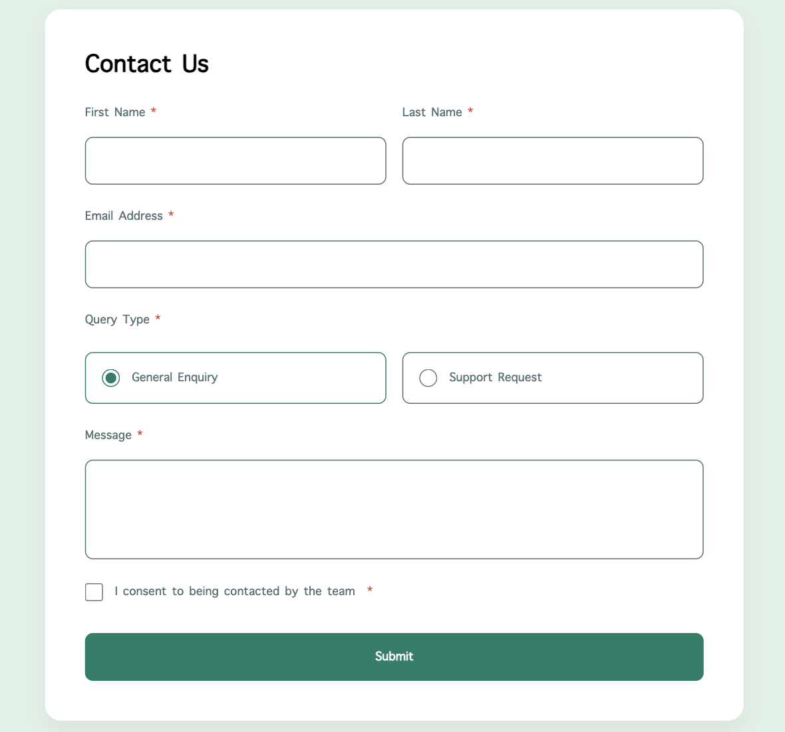

# Frontend Mentor - Contact Form Solution

This is a solution to the [Contact Form challenge on Frontend Mentor](https://www.frontendmentor.io/challenges/contact-form--G-hY17_gnH). This project is a fully functional contact form that captures user data and saves it to a **Google Sheet** using modern JavaScript.

## Table of contents

- [Overview](#overview)
  - [The challenge](#the-challenge)
  - [Screenshot](#screenshot)
- [My process](#my-process)
  - [Built with](#built-with)
  - [Key Concepts](#key-concepts)
- [Author](#author)

## Overview

### The challenge

Users should be able to:

- Complete the form and receive a success alert upon successful submission.
- See hover and focus states for all interactive elements.
- Receive validation errors if fields are empty (handled via HTML5 validation).
- **Bonus:** Data is sent asynchronously to a Google Sheet database without reloading the page.

### Screenshot


_(Update this path to your actual screenshot file)_


## My process

### Built with

- **HTML5:** Semantic markup for accessibility.
- **CSS3:** Custom properties, Flexbox, and the modern `:has()` selector.
- **JavaScript (ES6+):** Async/Await, Fetch API, and DOM Caching.
- **Google Apps Script:** Used as a serverless backend to handle data storage.

### Key Concepts

#### 1. Efficient DOM Caching

To optimize performance, all form elements are cached outside the event listener. This ensures the browser only "crawls" the DOM once when the script loads, rather than re-searching for elements every time the user clicks submit.

```javascript
// Cached once at the top level for better performance
const contactForm = document.getElementById("contact-form");
const firstNameInput = document.getElementById("first-name");
const submitBtn = document.getElementById("submit-btn");
```

#### 2. Asynchronous Form Submission (`async/await`)

I utilized an `async` helper function to handle the API request. This keeps the UI responsive and allows for a clean `try...catch...finally` flow to manage success and error states.

```javascript
async function submitForm(formData) {
  try {
    await fetch(SCRIPT_URL, {
      method: "POST",
      body: JSON.stringify(formData),
      mode: "no-cors", // Required for Google Apps Script cross-origin requests
    });
    alert("✅ Success! Your message has been sent.");
  } catch (error) {
    alert("❌ Oops! Something went wrong.");
  } finally {
    submitBtn.innerText = "Submit";
    submitBtn.disabled = false;
  }
}
```

#### 3. Modern CSS Styling with `:has()`

The form uses the modern `:has()` pseudo-class to style the parent container of a radio button when it is selected, providing a high-end feel without unnecessary JavaScript toggling.

```css
/* Highlights the card border only when the internal radio is checked */
.radio-card:has(input:checked) {
  border-color: var(--medium-green);
  background-color: var(--light-green);
}
```

#### 4. Google Sheets as a Backend

By deploying a Google Apps Script as a Web App, I transformed a standard spreadsheet into a functional database. The JavaScript `fetch` API sends the form data to the `/exec` endpoint, allowing for real-time data collection.

## Author

- Frontend Mentor - [@Allen1303](https://www.frontendmentor.io/profile/Allen1303)
- GitHub - [Allen1303](https://github.com/Allen1303)
